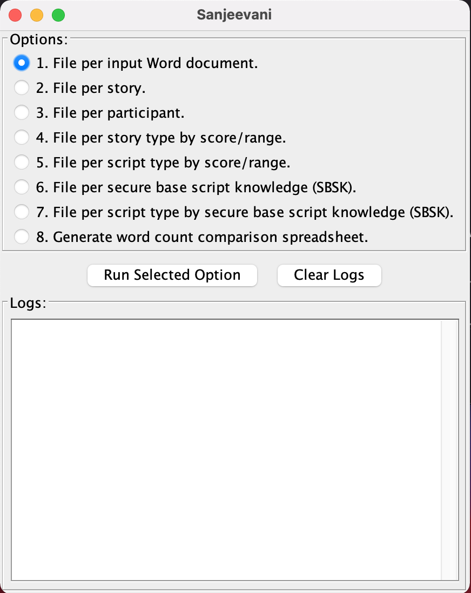
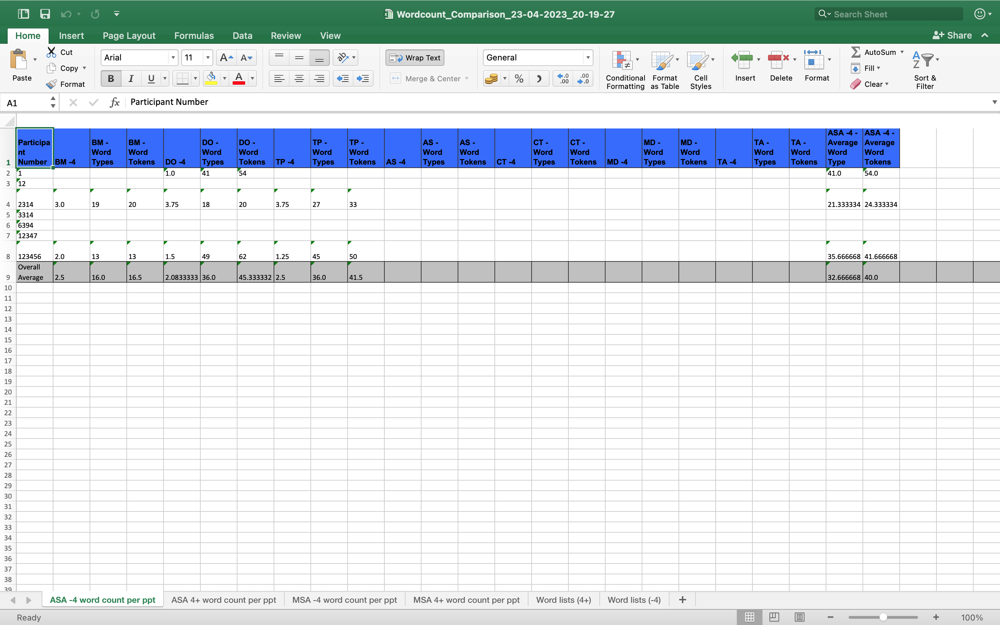
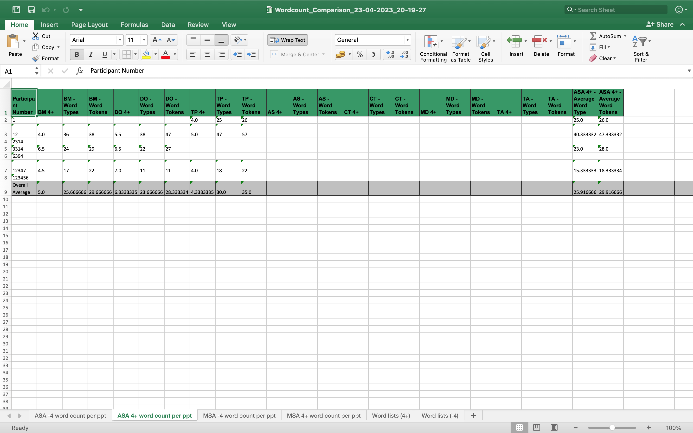
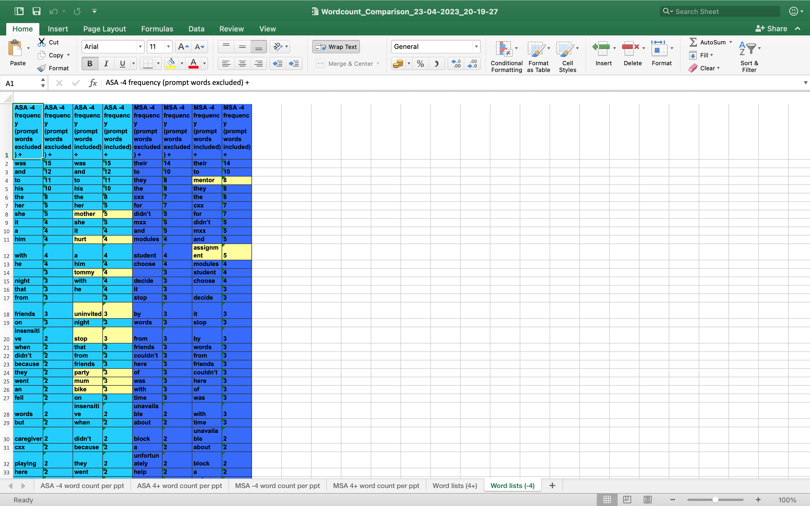
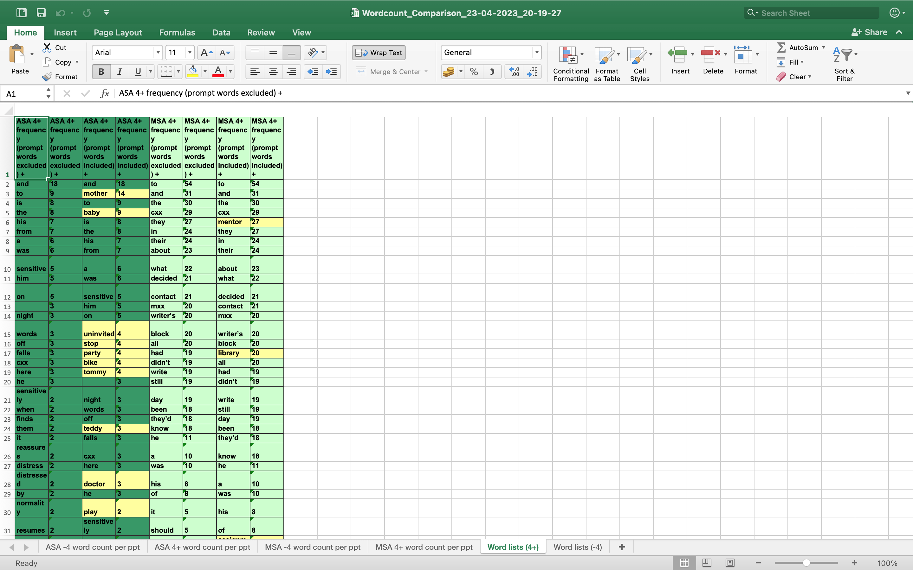

# Sanjeevani
A tool to convert word documents into text documents as well as useful word counting features.

**[Introduction](#introduction)&nbsp;&nbsp;-&nbsp;&nbsp;[Setup](#setup)&nbsp;&nbsp;-&nbsp;&nbsp;[Run](#run)&nbsp;&nbsp;-&nbsp;&nbsp;
[Options](#options)&nbsp;&nbsp;-&nbsp;&nbsp;[Contact](#contact)&nbsp;&nbsp;-&nbsp;&nbsp;[License](#license)**

## Introduction
This tool is to assist analysis of text data. It produces  text files and spreadsheets which can help with corpus linguistics analysis the original data more efficiently.<br/>
Sanjeevani word comes from a medicinal herb featured in the Hindu epic Ramayana. Just like the herb this tool can assist you to analyse your data!

## Setup
### Prerequisite
[Install Java](https://www.java.com/en/download/help/download_options.html)

### Preparing Input
- Copy your input word files into `/from` folder.

#### Input format
Input files needs to be in Microsoft Word format and with one of the below name:
```
<script type><4+/-4> standardised scores.doc(x)
```
<br>
Individual stories has to have a title with below format:
```
<story initials>-<score>-<paritcipant id>
```
Here, anything between `<>` braces are variables and needs to be replaced with appropriate values.
This needs to be followed by the actual story text and it must have a line break after the story text ends.
Also, make sure there are no line breaks anywhere else in the file.

## Run
- Double click on sanjeevani.jar file (use open with Java if not configured).
- Below window should appear on your screen:<br>

- Select one of the option from 1 to 8 and click on `Run Selected Option` button.
- To clear logs on the `Logs` box, click on `Clear Logs` button.
- To exit, click on `x` button on the top left window (For Windows and Linux - top right of the window).

## Options
### Option 1 - File per input Word document.
This will convert the individual input word files into text files at below location:
```
to/option-1/<original file name>.txt
``` 

### Option 2 - File per story.
This will convert individual stories within the input word files into individual text files per story at below location:
```
to/option-2/<script type>/<story initials>/<story number>.txt
``` 
So, if you have total of 50 story combined with all input word files then it will produce 50 text files as output files (one per story).

### Option 3 - File per participant.
This will convert the input word files into individual text files per participants at below location:
```
to/option-3/<participant id>-<total word count>.txt
``` 
Here, one file will be generated per participant and all the story belong to that participant will be included in that file.
 File name will also be suffixed with total word count of the stories from that file.

### Option 4 - File per story type by score/range.
This will convert the input word files into individual text files per story type by score range at below location:
```
to/option-4/<script type>/<story initials>/<story initials>-<score range>-<total word count>.txt
``` 
Here, score range can have below values:
```
1_1.99
2_2.99
3_3.99
4_4.99
5_5.99
6_6.99
7
```
So, one file will be generated with the above score range per story type and
 the file name will also be suffixed with total word count of the stories from that file.

### Option 5 - File per script type by score/range.
Similar to Option 4 however file will be generated per script type at below location:
```
to/option-5/<script type>/<script type>-<score range>-<total word count>.txt
``` 
So, one file will be generated with the above score range per script type and
 the file name will also be suffixed with total word count of the stories from that file.

### Option 6 - File per secure base script knowledge.
This will convert the input word files into two text files based on secure base script knowledge at below location:
```
to/option-6/<secure base script knowledge>-<total word count>.txt
```
Here, secure base script knowledge can have below values:
```
4_or_more
less_than_4
```
So, two files will be generated based on the score, one with 4 or more and the other with less than 4 score and
 the file name will also be suffixed with total word count of the stories from that file.

### Option 7 - File per script type by secure base script knowledge.
Similar to option 6 however it also takes script type into the consideration and generate file at below location:
```
to/option-7/<script type>/<script type>-<secure base script knowledge>-<total word count>.txt
```
So, two files will be generated per script type based on the score, one with 4 or more and the other with less than 4 score and
 the file name will also be suffixed with total word count of the stories from that file.

### Option 8 - Generate word count comparison spreadsheet.
This option generates a comprehensive word count comparison spreadsheet which can be extremely useful for a detailed corpus linguistics analysis.
<br>
Running option 8 will generate a spreadsheet at below location:
```
to/option-8/Wordcount_Comparison_<current date>_<current time>.xslx
```
Here,<br>
Current date will be formatted as `DD-MM-YYYY`.<br>
Current time will be formatted as `HH-mm-SS`.<br>

> Please note that any matching performed as a part of word counting or listing exercise is case-insensitive,
 this mean treating or interpreting upper and lowercase letters as being the same.
<br>
For example, `Doctor`, `doctor` and `DOCTOR` will be treated the same.

#### Exclusion words
These are list of words that you would like to omit in the word count exercise.
 You will have to create one text file per story type with the list of exclusion words for that story.
 Make sure you have set of words per line and name the file with the initials of the story type with `.txt` extension.
 Also, you can have more than one word for an exclusion word e.g. friday night can be one exclusion word
 and in that case have the full word in a single line.
 Hence, the path should look like:
```
from/prompt/<story initials>.txt
```
The output spreadsheet will generate two sets of tabs.
 One with various word counts for individual stories per participants, and
 the other with the list of unique words for individual script types with and without exclusion words.
 
#### Word Counts
Two sheets will get generated per script type, one with the score less than 4 and the other with 4 and more.
 `less than 4` sheet headers' colour is set to blue and `4 and more` headers' is set to green.
 This sheet will have individual row for a participant and three columns for an individual story type.
 1. Score
 2. Word Types - total **unique** words
 3. Word Tokens - total words
 
 This sheet will also have two additional columns in the end:
 1. Average Word Types - average of all the word types for that participant
 2. Average Word Tokens - average of all the word tokens for that participant
 
An example output sheet for word counts for `less than 4`:

An example output sheet for word counts for `4 and more`:


#### Word Lists
Two sheets will get generated, one with score less than 4 and the other with 4 and more.
 `less than 4` sheet headers' colour is set to blue and `4 and more` headers' is set to green.
 This sheet will have individual row for unique words from the given input stories.
 It will generate four columns per script type:
 1. Word where `exclusion words` are excluded.
 2. Word count for the above.
 3. Word where `exclusion words` are included and highlighted in yellow.
 3. Word count for the above.
 
> Please note following list of characters will be ignored for matching and calculating the `exclusion words`:
 ```
 ’
 ’s
 '
 's
 .
 ,
 ?
 !
 "
 (
 )
 :
 ;
 ```
> For example, if `doctor` is in the list of `exclusion words`, `doctor's` or `(doctor)` will be considered while calculating total Word lists.

An example output spreadsheet for word lists for `less than 4`:

An example output spreadsheet for word lists for `4 and more`:


## Contact
If you have any issue running this tool, and you couldn't resolve with this documentation,
 or you would like to discuss any business about this tool,
 you can email [the author](mailto:leabhidesai@gmail.com).

## License
Copyright © 2023, [Abhi Desai](https://github.com/ardesai/) and [Lisa Gentle](https://orcid.org/my-orcid?orcid=0000-0001-9944-5824).
